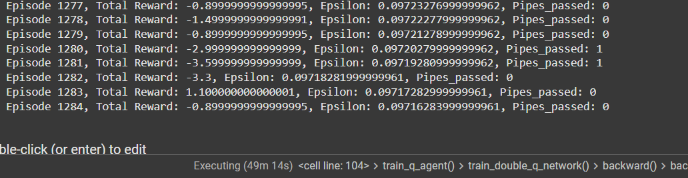

# Flappy Bird
## Training a Neural Network using Q-learning Algorithm to control an agent in the Flappy Bird game
### Team Members:
- **Căprioară Alina** 
- **Neagu Alex-Ștefan**

## Introduction

This report provides the architecture, hyperparameters and experimentation attempts to optimize the process of maximizing final reward.
As setup, we used the flappy-bird-gymnasium environment.

### [[Demo Video]](https://youtu.be/jPBf9_DFl5Y)
## Architecture

### I. First Attempt - Outline image preprocessing

### Workflow
1. Environment initialization
2. Frame preprocessing and stacking
3. Action selection
4. Frame jumping if action="flap"
5. Observing for OBSERVE number of episodes and then training the neural network.

###  Neural Network

We used a Convolutional Neural Network (CNN) with the purpose of processing the game stacked frames and predicting the Q-values for each action.

1. **Input Layer**: 4 stacked frames of the game (84x84x4)
2. **Convolutional Layers**:
   - **Layer 1**: Conv2D with 32 filters, kernel size 8x8, stride 4, and ReLU activation.
   - **Layer 2**: Conv2D with 64 filters, kernel size 4x4, stride 2, and ReLU activation.
   - **Layer 3**: Conv2D with 64 filters, kernel size 3x3, stride 1, and ReLU activation.
3. **Fully Connected Layers**:
    - **Fully Connected Layer 1**: 256 neurons and ReLU activation.
    - **Fully Connected Layer 2**: 256 neurons with output of action space size (2 actions: flap/do nothing)

The output consists of the Q-values for each action(flap/do nothing).

### Image Preprocessing

The RGB frame obtained by rendering the game is preprocessed for optimized training.
- **Grayscale Conversion**
- **Edge Detection Using Conv2d**: To detect the outline of the objects in the frame in order to simplify the image and accentuate the important features, each frame passes through an edge detection filter.
- **Resizing**: The frames are resized to 84x84.
- **Normalization**: The pixel values are normalized to the range [0, 1].

### Hyperparameters

| Hyperparameter     | Value  |
|--------------------|--------|
| Learning Rate      | 0.01   |
| Gamma              | 0.99   |
| Batch Size         | 32     |
| Initial Epsilon    | 1.0    |
| Final Epsilon      | 0.01   |
| Epsilon Decay      | 0.995  |
| OBSERVE            | 1000   |
| EXPLORE            | 10000  |
| Replay Buffer Size | 5000   |

### Results

###  II. Second Attempt - Final version - Improved image processing

We improved the image processing by implementing a black and white conversion.
The outline of the objects was set to white, while everything else was set to black.
Another improvement in this attempt was cropping the ground.
These changes added a significant improvement in the training process, as the frames were now simplified, better suited for training.

#

### III. Other attempts - Dual Q-Learning

We tried implementing Dual Q-Learning, with 2 networks: QA and QB.
The idea mainly consists in using QB_target to calculate the target Q-value when QA selects the action, and vice versa. 

This alternation helps stabilize the training, as the action selection and target evaluation are being done by different networks.

We noticed slower training in this experiment, thus returning to the original Q-learning algorithm.

#

### Conclusions

We noticed the first 1000 iterations in which the agent only observes the environment and doesn't train are important for the training.
